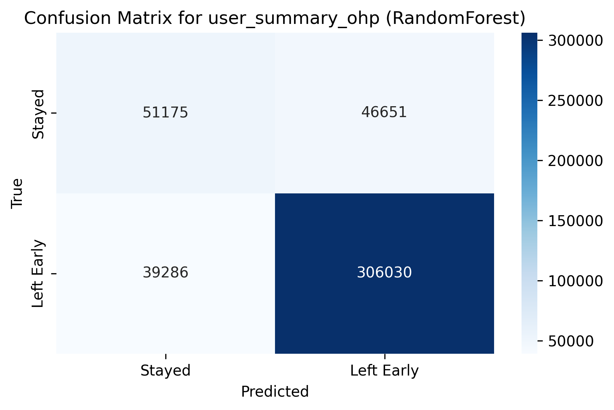
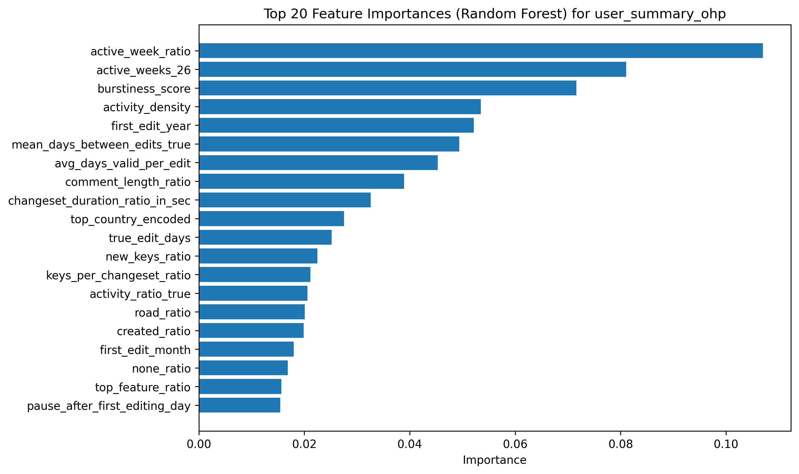
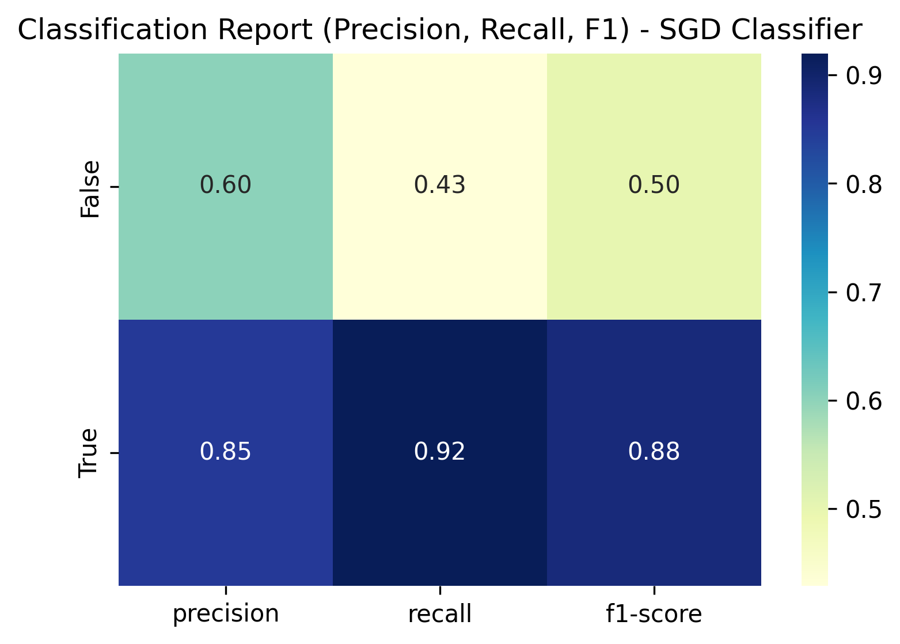
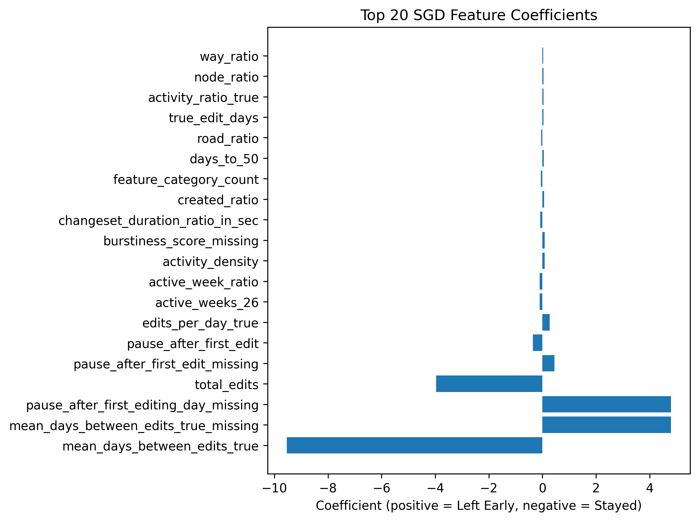
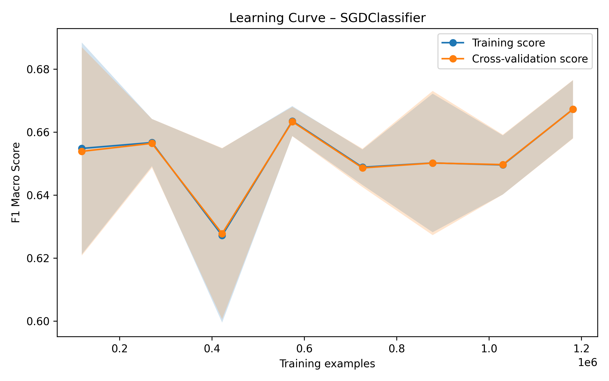
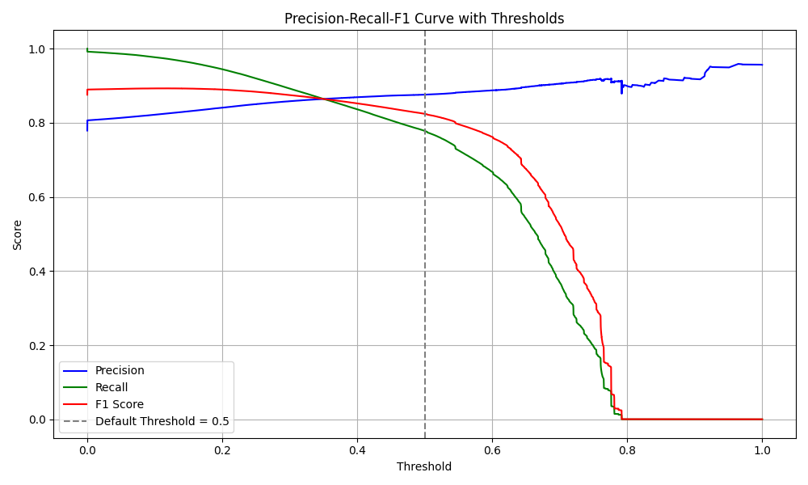

# Predicting OSM Contributor Retention – Master’s Thesis

This part of the thesis focuses on the **prediction of OpenStreetMap (OSM) contributor retention**.  
The central research question is:

> **Can it be predicted whether a new OSM user will stop contributing within the first six months after their first edit?**

The analysis is based on **OSM full-history data**, which were aggregated into **user-level features** covering the first 180 days after a user’s initial edit.  
Subsequently, **supervised machine learning models** were applied to assess whether the previously defined target variable **`left_early`**—indicating whether a user leaves the platform within six months—can be reliably predicted based on the constructed features.

---

## Data Preparation

### Final `user_summary` Table
The `user_summary` table aggregates daily activity per user, restricted to the first 180 days after the initial edit.  
It contains a wide range of **temporal, spatial, and contribution-related variables**.

### Newly Added Columns in the `user_summary` Table

For the classification task, the following derived variables (29 in total) were added:

- **Activity and Temporal Features**
  - `active_weeks_26`: Number of active weeks within the first 26 weeks.
  - `active_week_ratio`: Ratio of active weeks to the total of 26 weeks.
  - `activity_density`: Ratio of edit days to the overall activity span.
  - `early_days_ratio`: Proportion of active days (at least one edit) within the first 30 days that fall into the first week.
  - `frontload_ratio`: Share of edits occurring within the first 30 days.
  - `pause_after_first_edit`: Number of days between the first and second edit.
  - `pause_after_first_editing_day`: Number of days between the first and second editing day.
  - `days_to_50`: Number of days until the 50th edit.
  - `days_to_100`: Number of days until the 100th edit.
  - `first_edit_month`: Month of the first edit.
  - `avg_days_valid_per_edit`: Average validity duration of the edited objects.
  - `edits_per_span_day`: Number of edits divided by the length of the observed time span (edits per day).

- **Contribution Intensity and Patterns**
  - `id_changeset_ratio`: Proportion of changesets created with the iD editor.
  - `josm_changeset_ratio`: Proportion of changesets created with the JOSM editor.
  - `streetcomplete_changeset_ratio`: Proportion of changesets created with the StreetComplete editor.
  - `other_id_changeset_ratio`: Proportion of changesets created with other editors.
  - `edits_per_changeset_ratio`: Ratio of edits to changesets.
  - `changesets_per_edit_day`: Number of changesets per editing day.
  - `changeset_duration_ratio_in_sec`: Distribution/ratio of changeset durations.
  - `comment_length_ratio`: Average length (in characters) of changeset comments.

- **Structural and Tag-Related Variables**
  - `keys_per_changeset_ratio`: Number of added plus deleted keys per changeset.
  - `new_keys_ratio`: Proportion of newly added keys relative to edits.
  - `deleted_keys_ratio`: Proportion of deleted keys relative to edits.
  - `geometry_tag_ratio`: Ratio of geometry edits to tag edits.
  - `feature_category_count`: Number of distinct feature categories edited by a user.
  - `diversity_score`: Diversity of edited features, reflecting how broadly and extensively a user contributes across countries.

- **OSM Object Types**
  - `node_ratio`: Proportion of edits affecting nodes.
  - `way_ratio`: Proportion of edits affecting ways.
  - `relation_ratio`: Proportion of edits affecting relations.

- **Target Variable**
  - `left_early`: Binary variable (`True` = user stops contributing within 180 days; `False` = user remains active).  
    → Used as the **evaluation indicator** for the prediction task.

---

## Modeling

### Applied Models
Two classifiers were evaluated:

1. **Random Forest Classifier**
   - Advantages: Robust with high-dimensional feature spaces; interpretable via feature importance.
   - Used as a baseline model.

2. **Stochastic Gradient Descent (SGD) Classifier**
   - Linear model tested with different loss functions (including logistic regression) and regularization schemes (L2, L1, ElasticNet).
   - Well suited for very large datasets due to its high training efficiency.
   - Key hyperparameters (e.g., `alpha`, `l1_ratio`, `class_weight`) were optimized using a randomized search strategy.

---

## Results

### 1. Random Forest
- **Confusion Matrix**  
  

- **Classification Report**  
  

- **Feature Importance**  

- **Learning Curve**  

- **SHAP**  

## Overall Information
| Model          | Train Time (s) | Predict Time (s) | Precision False | Recall False | Precision True | Recall True |
|----------------|----------------|------------------|-----------------|--------------|----------------|-------------|
| Random Forest  | 293.81         | 0.59             | 0.57            | 0.52         | 0.87           | 0.89        |

### 2. SGD Classifier
- **Confusion Matrix**  

- **Classification Report**  

- **Feature Importance**

- **Feature Importance**

- **Learning Curve**  

- **Precision and Recall Thresholds**  

## Overall Information
| Model           | Train Time (s) | Predict Time (s) | Precision False | Recall False | Precision True | Recall True |
|-----------------|----------------|------------------|-----------------|--------------|----------------|-------------|
| SGD Classifier  | 437.30         | 0.09             | 0.60            | 0.43         | 0.85           | 0.92        |
